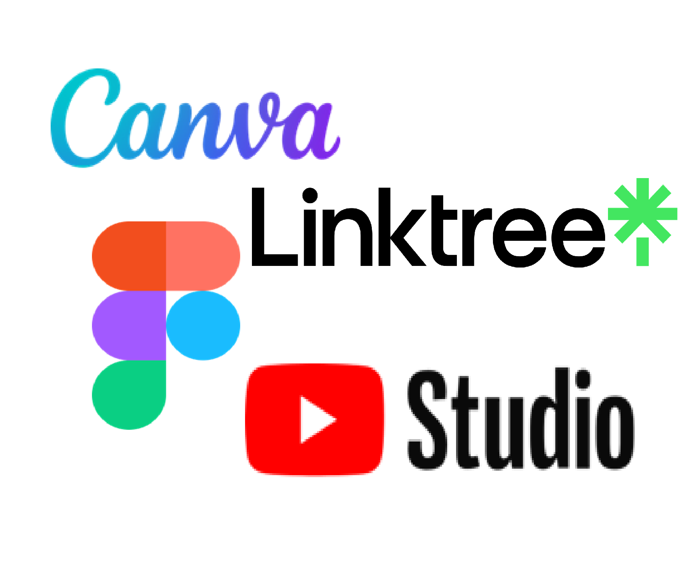

# INKPOTS TATTOO STUDIO – FINAL YEAR PROJECT – EMILY HALLEY - 20092335


INKPOTS TATTOO STUDIO enhances the UX and UI for a tattoo studio's online presence in the South East by improving client engagement and centralizing the studio in Waterford City as a web application. <br>This final project modernizes the studio's online presence using technologies to enhance how it showcases its talented artists tattoo portfolios, all while being mindful of the studio's budget constraints.

Tattoos have a rich history, dating back thousands of years, serving as a form of personal expression, cultural significance, and art using many different forms of techniques and methods for inserting inks into a fixed place on the body. 

Despite their popularity, many studios face the common issue of not having a proper online presence. If they do, it’s often an outdated WordPress or Wix website that is broken, insecure, and not visually pleasing or easy to navigate, or they rely on social media sites such as Facebook, Instagram, or WhatsApp. This makes it difficult for clients to find reliable information about the studio, view artists’ portfolios, and get in touch with the studio and their favourite tattoo artist. 

As a developer, I wanted to help a tattoo studio improve its online presence, much like a web solutions company would, enabling them to move away from relying solely on outdated websites or social media platforms. It targets towards studios operating on a budget, ensuring that cost-effective advanced technologies solutions are included keeping up the studios work quality. Thereby, This project involves creating a modern, centralized web application that enhances the studio’s online presence and client engagement using the latest technologies.


## OVERVIEW - INKPOTS TATTOO STUDIO
INKPOTS TATTOO STUDIO is a Web application created for people who are interested in getting a tattoo. This web app is managed by the studio admins and artists to update all of the content to efficiently manage studio details, services, team members, testimonials, events, gallery, pricing, FAQs, and contact information and lots more. This gives new clients and existing clients to  browse through the site and gain information about styles, artists, testimonials and can send messages using the contact page. If a client has picked an artist they want to work with, between the client and artist and admin. They can sign up to a communications app to message each other about their tattoo goals, ideas, aftercare etc. This studio is designed constantly throughout making it easy to use and visually appealing. 


## ROLE BASED ACCESS CONTOL 

- **Studio Admins and Artists** – They manage all studio-related information, including services, team members, events, gallery updates, and pricing etc.
- **Clients/Visitors** – They browse studio details, services, and events, access FAQs, and contact the studio etc.


## METHODOLOGIES

- **Scrum**– Iterative and incremental software development framework for collaboration and continuous delivery.
- **Trello** – Visual project management and task management tracking to focus for tasks needed to be completed, pending, backlogging or started.
- **Sprints** – Short development cycles for rapid delivery taking from 1 to 4 weeks for each software development cycle for planning, execution, review, and retrospective.
- **Agile** – Flexible and collaborative software development methodology for incremental releases for each feature, with project evolvement based on feedback requirements and expectations.


## TECHNOLOGIES

### CORE TECHNOLOGIES 

- **MERN Stack** – Full-stack JavaScript framework using MongoDB, Express, React and Node.js
- **Postman** – API testing and development tool for sending, inspecting and debugging endpoints, providing a GUI for RESTful API services.
- **VS Code** – Lightweight code editor for development for accessing tools such as command prompt, downloadable extensions, Git integration and autocomplete debugging tools. 
- **Chrome** – Web browser optimized for performance and rendering interactive web applications.
- **Chrome DevTools** – Built-in debugging tools for live editing CSS/JS, Performance profiling, Network request monitoring, API calls, local storage.
- **Firefox** – Privacy-focused web browser for memory efficiently and incognito mode.
- **Firefox Devtools** – Advanced Debugging
- **NPM (Node Package Manager)** – Dependency management tool for installing, updating, and managing JavaScript libraries for Node.js applications. 
- **GitHub** – Version control and collaboration platform for pushing, pulling requests for changes in code.
- **GitHub Pages** – Hosting application as a live website from configuring the repo.
- **Nodemon** – Automatic server restart for Node.js during development changes in realtime for rapid debugging. 
- **JavaScript** – Core programming language for web development back and frontend for React, Node, Express and MongoDB for event-driven programming<br> for interactivity and asynchronous data handling with APIs.
- **CSS / Tailwind CSS** - Styling language for web design.
- **HTML** – Markup language for structuring web pages.


### FRONTEND TECHNOLOGIES 

- **React.js** – Component-based UI framework builds with JavaScript using a virtual DOM to enhance rendering efficiency with declarative syntax. 
- **Tailwind CSS** – Utility-first CSS framework for design for customisable use of JSX using utility classes, no need to write custom styles as its built-in responsive grid system and pre-defined utility classes.
- **Axios** – Promise-based HTTP client for JavaScript for asynchronous HTTP requests to API to enable for data fetching, error handling, and response processing, supporting automatic JSON conversion between the backend(Node.js) and frontend(React.js)
- **FontAwesome** – Scalable vector icons for UI components for buttons, navigation, alerts, and interactive elements, making the UI more engaging with CSS. 
- **Tailwind Vite** – Tailwind CSS optimized for Vite.js making the layouts load quicker on the app when loading up with fater development speeds and instant updates in development mode.
- **Vite.js** – Lightweight development server for React using the lightning-fast hot module replacement (HMR),<br> reducing startup time and enhancing build performance for modern web applications seeing realtime changes to your code without the need to restart or refresh the application starts up or browser.
- **React DOM** – React’s interface with the browser and it effectively is interacting with HTML elements dynamically.
- **React Icons** – Customizable icons for React applications providing scalable and customizable vector icons
- **React Vertical Timeline Component** – Timeline visualization for events with interactive elements for marking a timeline event such as showcasing studio history, upcoming events, or project milestones.
- **Socket.io Client** – Real-time communication for React to allow it to communicate with the backend to the frontend with live chatting systems and real-time updates.


### BACKEND TECHNOLOGIES 

- **Node.js** – JavaScript runtime for backend development to create server-side applications for handling multiple requests that’s non-blocking and event driven.
- **Express.js** – Web framework for Node.js that simplifies the creation of APIs for backend logic. It gives tools for routing, middleware integration, and request handling, making backend development more streamlined. 
- **MongoDB** – NoSQL document-oriented database for storing data in as a JSON format giving a flexible schema design to store, text, files, images etc.
- **bcrypt** – Password hashing for security to ensure that all of the users passwords are not a readable plaintext file for others to read stored in the database. It uses a strong one-way encryption algorithm, making passwords resistant to brute-force attacks.
- **CORS (Cross-Origin Resource Sharing)**– Middleware for API security which checks who is allowed to view the parts of the API. Powered by RBAC roles and crucial in web applications where the frontend and backend communicate across different domains.
- **dotenv** – Environment variable management in Node.js to secure access to sensitive parts of the application, ie, secure access to API keys, database credentials, and other sensitive information without exposing them in the codebase.
- **jsonwebtoken (JWT)** – Authentication & user session security for managing session handling for each user logged in on the system, without storing sensitive user data on the server, making authentication more efficient and setting a limit to how long they can be - logged in for. If the user is logged in and the token was set to 2hrs they would be able to use the app for two hours and after the time is up they would be automatically logged out and need to login again to start another session.
- **Mongoose** – ODM (Object Data Modeling) for MongoDB, making it easier for interacting with MongoDB with models, validation, and schema definitions, while maintaining its structure.
- **Multer** – File upload handling for images and media using API requests.
- **Socket.io** – Real-time bi-directional communication for live updates and chatting functionalities.
- **WebRTC** – Peer-to-peer streaming for video & audio communication in the browser.


### GRAPHIC DESIGN & MEDIA 

- **Microsoft Designer** – AI-powered graphic design tool to create images quickly and easily by typing in a suggestion prompt using advanced machine learning to generate templates, images, and custom branding tailored to user input.
- **Canva** – Online graphic design platform for easy content creation or creating imagery, posters. Videos etc.
- **Figma** – Collaborative UX/UX design tool for prototyping
- **YouTube Studio** – Video content creation and management platform video editing tools, thumbnails customization,
- **Linktree** – Centralized bio link tool for creating custom landing pages with relevant links under a single, shareable link website for easy navigation.


## Installation

## 1. Clone the repository:
   ```bash
   git clone https://github.com/emily172/FYP-Tattoo.git
   ```

```bash
cd tattoo-web-app
 ```


## 2. Install Dependencies
INKPOTS TATTOO STUDIO consists of a frontend (React.js) and backend (Node.js & Express.js). <br>Install dependencies for both each in two separate command line windows.

### Frontend (React.js Setup)
Navigate to the frontend directory:
```bash
cd tattoo-website
```
Install required packages:
```bash
npm install
```


### Backend (Node.js & Express Setup)

Navigate to the backend folder:
```bash
cd server
```
Install backend dependencies:
```bash
npm install
```


## 3. Configure Environment Variables
Create a .env file in the backend folder and define sensitive configurations:
```bash
MONGO_URI=mongodb://localhost:27017/inkpots-studio
JWT_SECRET=yourjwtsecret
```

## 4. Start the Development Server

### Frontend
```bash
npm run dev
```

### Backend
(Nodemon will restart the backend automatically on file changes.)
```bash
nodemon server.js
```


##  5. Testing API Endpoints
Use Postman to test API sample requests(you can test any endpoint):
<br>
NOTE YOU NEED TO GET THE ID TO PUT AND DELETE
```bash
GET → Retrieve tattoos
http/localhost:5000/tattoos

POST → Add tattoos
http/localhost:5000/tattoos 

PUT → Edit a tattoo
http/localhost:5000/tattoos/id 

DELETE → Remove a tattoo
http/localhost:5000/tattoos/id
```


##  6. User Guide
### For Administrators or Tattoo Artitsts
1. Register to the Admin Panel
2. Login to the Admin Panel
3. Update Studio Information
4. Manage Services, Team, and Events
5. Modify Pricing & Gallery
6. Update FAQs & Contact Details
7.Save Changes & Publish Updates

### For Clients & Visitors
1. Browse Studio Details
2. Check Available Services
3. Learn About the Team, artists and styles
4. Read Testimonials
5. View Upcoming Events
6. Explore the Gallery
7. Check Pricing
8. Read FAQs
9. Use Contact Section to Reach Out
10. Sign up and Chat with an artist


## Acknowledgments 💡
I would like acknowledge and Special thanks to:

- **My supervisor Sinead O'Neill** <br> who has guided me every step of the way to provide suggestions and feedback on my project maintaining contact, project management through regular scrum meetings.

- **My Self** <br>  who took the leverage to work hard and develop my project successfully and effectively through every step. 

- **Leactures** <br> who have guided me throughout my university journey giving the best support and help with every module taken, this has lead me to develop my final year project.


## References